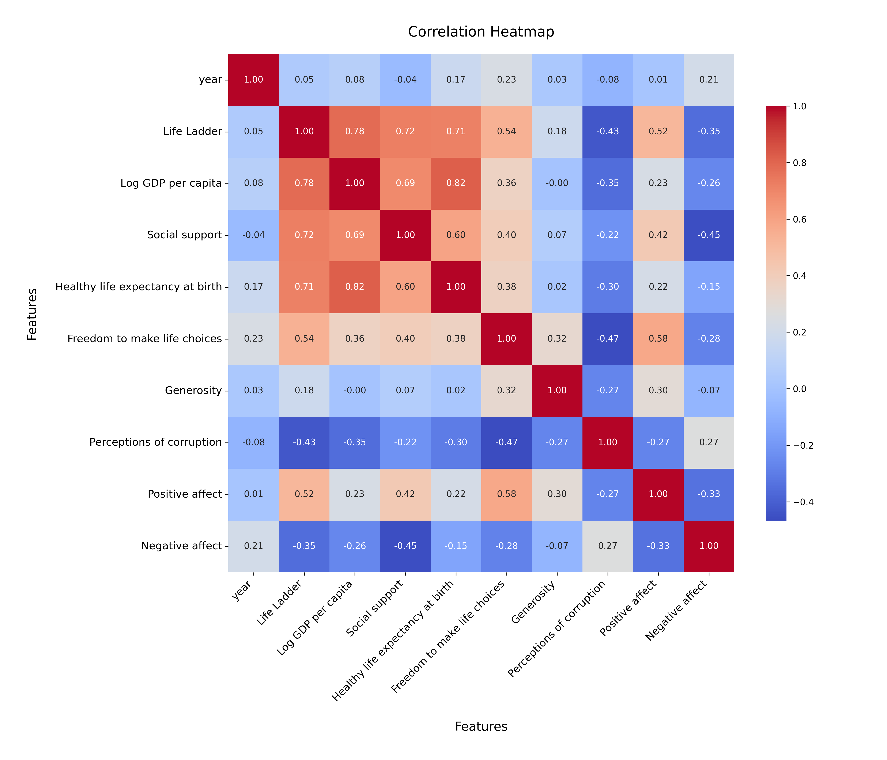
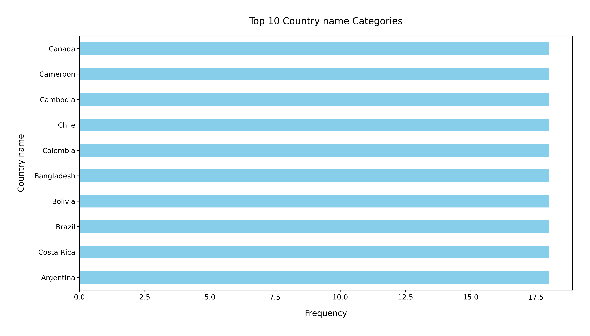

# Analysis Report

### Summary of the Dataset

The dataset `happiness.csv` contains data on various factors affecting happiness across 2363 observations and 11 features. The key columns include:

- **Country name**: Identifies the country.
- **Year**: The year of the observation, spanning from 2005 to 2023.
- **Life Ladder**: A measure of subjective well-being or happiness.
- **Log GDP per capita**: The logarithm of GDP per capita, reflecting economic prosperity.
- **Social support**: Indicates social relationships and networks.
- **Healthy life expectancy at birth**: Reflects the average number of years a newborn is expected to live in good health.
- **Freedom to make life choices**: A measure of personal freedom.
- **Generosity**: Captures altruistic behavior.
- **Perceptions of corruption**: Reflects the public's perception of corruption in the government and businesses.
- **Positive affect** and **Negative affect**: Measures of emotional states.

### Key Insights

1. **Missing Values**: There are missing values in several columns, notably:
   - **Generosity** (81 missing), **Perceptions of corruption** (125 missing), and **Healthy life expectancy at birth** (63 missing) have substantial gaps that could affect analysis.
   
2. **Life Ladder**: The average happiness score (Life Ladder) is approximately **5.48**, indicating a moderate level of happiness across countries. The scores range from **1.281** to **8.019**, suggesting significant disparities in happiness between countries.

3. **Economic Factors**: The mean **Log GDP per capita** is around **9.40**, with a minimum value of **5.527**. This implies a correlation between higher GDP and higher happiness levels, which can be visualized through scatter plots showing the relationship between GDP and the Life Ladder.

4. **Social Support and Happiness**: The mean score for **Social support** is **0.81**, indicating that strong social networks are prevalent in many countries. This may correlate positively with happiness levels.

5. **Freedom to Make Life Choices**: The average score is **0.75**, suggesting that personal freedom is a significant component of overall happiness.

6. **Emotional States**: The average **Positive affect** is **0.65**, while **Negative affect** is **0.27**, indicating a generally positive emotional experience across the surveyed populations.

### Recommendations

1. **Addressing Missing Values**: It is crucial to handle the missing data effectively. Strategies could include imputation methods or excluding affected rows, depending on the analysis' focus.

2. **Further Analysis on GDP and Happiness**: Conduct a detailed correlation analysis and regression modeling to quantify the impact of GDP on happiness and identify other contributing factors.

3. **Promote Social Support Programs**: Given the positive correlation between social support and happiness, initiatives aimed at enhancing community engagement and social networks could be beneficial.

4. **Enhancing Personal Freedom**: Policies that improve personal freedoms and individual choices may contribute positively to overall happiness scores.

5. **Longitudinal Studies**: Given the dataset spans multiple years, longitudinal studies could help in observing trends over time and the effects of socio-economic changes on happiness.

6. **Visualizations**: Utilize charts to communicate findings effectively. Scatter plots, bar graphs, and heat maps could visualize correlations between variables and distributions of happiness across countries.

By implementing these recommendations, policymakers and researchers can better understand and enhance the factors contributing to happiness in various populations.

