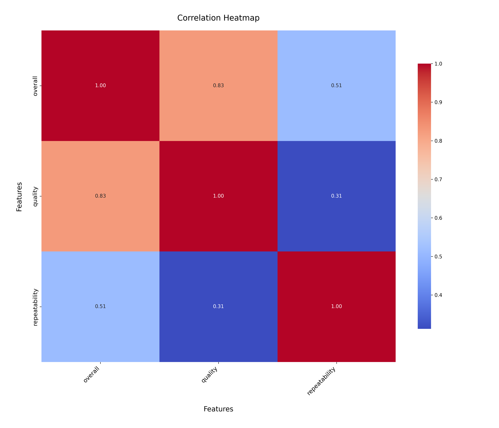
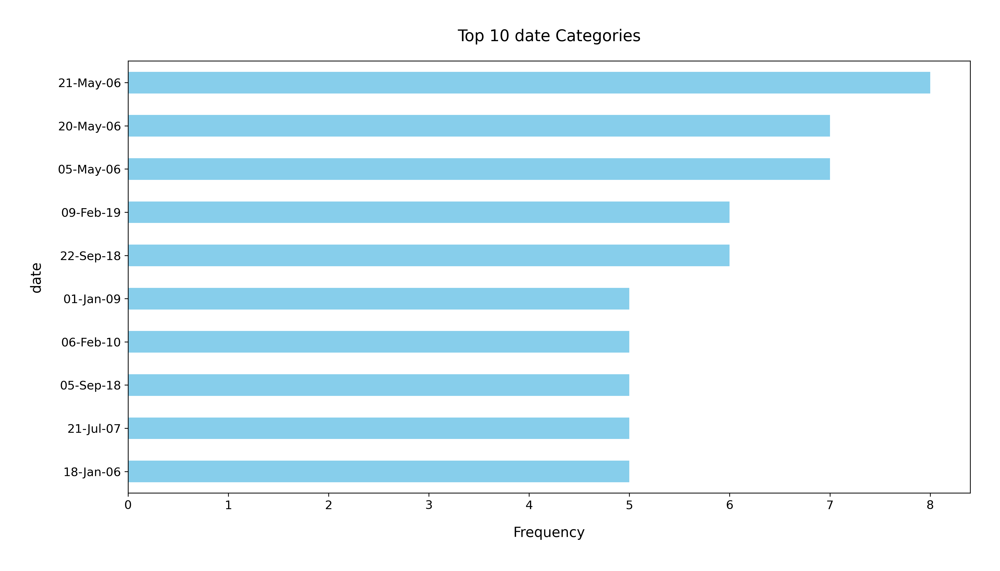

# Analysis Report

### Dataset Summary

The dataset analyzed is titled `media.csv` and contains 2,652 records across 8 columns, detailing various attributes of media entries. The columns include:

- **date**: The date associated with the media entry (with 99 missing values).
- **language**: The language of the media (no missing values).
- **type**: The type of media (no missing values).
- **title**: The title of the media (no missing values).
- **by**: The creator or contributor of the media (262 missing values).
- **overall**: A numerical rating reflecting the overall quality of the media (no missing values).
- **quality**: A rating for the quality of the media (no missing values).
- **repeatability**: A numerical value indicating how repeatable the content is (no missing values).

### Key Insights

1. **Missing Values**: 
   - There are significant missing values in the `date` (99) and `by` (262) columns. This could potentially affect analyses that rely on these fields.

2. **Language Distribution**:
   - There are 11 unique languages, with English being the most frequent (1,306 entries), indicating a strong focus on English media content.

3. **Type of Media**:
   - The dataset includes 8 unique types of media, with movies being the most common (2,211 entries), suggesting that the dataset is heavily skewed towards films.

4. **Title Diversity**:
   - The dataset includes a diverse array of titles (2,312 unique titles), which is indicative of a rich variety of content available.

5. **Creator Diversity**:
   - There are 1,528 unique contributors, with Kiefer Sutherland being the most frequent (48 entries). This suggests a diverse range of contributors, but with some prominent figures.

6. **Rating Insights**:
   - The average overall rating is approximately 3.05 (out of 5), with a standard deviation of 0.76, indicating a moderate rating distribution. 
   - The quality rating has a slightly higher average of approximately 3.21, suggesting that while the overall media may be rated moderately, the quality tends to be rated a bit higher.
   - The repeatability rating averages around 1.49, indicating that most entries are not seen as highly repeatable, with a maximum of 3.

### Recommendations

1. **Address Missing Values**:
   - It is advisable to handle missing values in the `date` and `by` columns. Techniques such as imputation, removal, or analysis of the impact of these missing values should be employed depending on the analytical goals.

2. **Explore Non-English Content**:
   - Given the predominance of English content, it may be beneficial to explore media in other languages to diversify offerings and potentially capture a broader audience.

3. **Analyze Media Types Further**:
   - A deeper analysis into the different media types could uncover trends or preferences among users, guiding content creation and curation strategies.

4. **Investigate Ratings**:
   - Explore the relationship between the `overall`, `quality`, and `repeatability` ratings to identify potential areas for content improvement or to highlight successful content types.

5. **Focus on Contributors**:
   - Identifying successful contributors can help inform partnerships or promotional strategies, especially if certain contributors consistently produce highly-rated content.

6. **Visualizations**:
   - Utilize visualizations such as bar charts for language distribution, pie charts for media types, and box plots for rating distributions to present the data insights more effectively and aid in decision-making.

By implementing these recommendations, stakeholders can gain deeper insights and make informed decisions regarding media content strategy and development.

